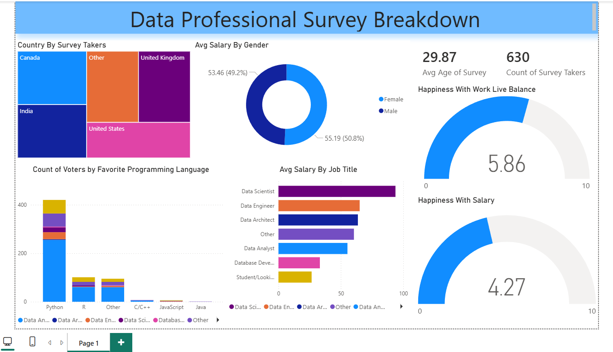

# 📊 Data Professional Survey Analysis

## 📝 Description
This project analyzes a survey dataset of data professionals from different countries to uncover insights about salaries, job roles, satisfaction levels, and trends in the data industry.

---

## 🔍 What I Did
- Cleaned and transformed raw data  
- Handled missing values  
- Standardized columns  
- Created key measures:
  - Average Salary  
  - Average Age  
  - Count of Survey Takers  
- Built an interactive dashboard using Power BI  

---

## 📊 Dashboard Preview

---

## 🔗 Live Dashboard
You can view the interactive dashboard here:  
https://app.powerbi.com/groups/me/reports/99a5cb77-ea2f-44d8-958f-15c38c1adb48/283e77d3112f185ed037?experience=power-bi  

⚠️ Note: Access may require Power BI permissions.

---

## 📊 Key Insights
- Data Scientists have the highest average salaries  
- Python is the most popular programming language  
- Work-life balance satisfaction is higher than salary satisfaction  
- Most respondents are from USA, India, and UK  
- Average age is حوالي 30 years  

---

## 🛠 Tools Used
- Power BI  
- Excel  

---

## 🎯 Project Goal
To practice real-world data analysis and extract meaningful insights that reflect the data job market.

---

## 👨‍💻 Author
Mohamed Sobhy  
Aspiring Data Analyst

